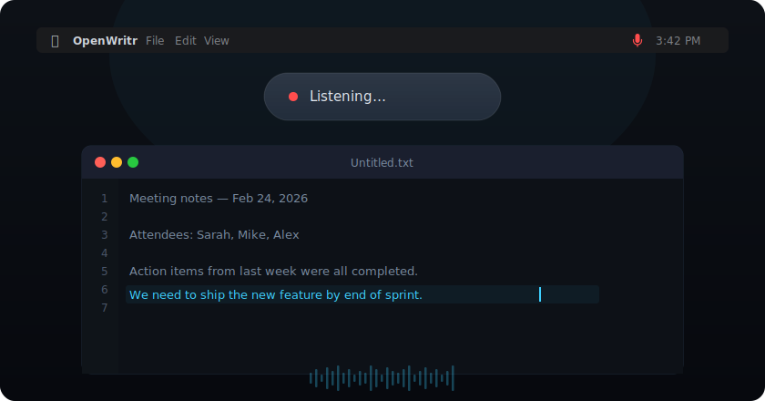

# OpenWritr

[](LICENSE)
[](https://github.com/trsdn/OpenWritr)
[](https://swift.org)
[](https://github.com/trsdn/OpenWritr)
[](https://github.com/trsdn/OpenWritr/releases)

Native macOS menu bar app for push-to-talk voice-to-text. Hold the Fn key, speak, release — transcribed text is pasted at your cursor. Completely local, powered by Apple Neural Engine.

**[Website](https://trsdn.github.io/OpenWritr/)** · **[Download](https://github.com/trsdn/OpenWritr/releases/latest/download/OpenWritr-v1.1.0-macOS-arm64.zip)** · **[Release](https://github.com/trsdn/OpenWritr/releases)**

<p align="center">
  
</p>

## How It Works

1. **Hold Fn** — microphone activates, a floating overlay confirms recording
2. **Release Fn** — audio is transcribed via NVIDIA Parakeet TDT v3 on the Neural Engine
3. **Text appears** — result is pasted into whatever app is focused

## Performance

| Metric | Value |
|--------|-------|
| End-to-end latency | < 1 second |
| Model | NVIDIA Parakeet TDT 0.6B v3 |
| Inference | Apple Neural Engine via CoreML |
| Runtime memory | ~38 MB physical |
| Peak memory | ~48 MB physical |
| App bundle | 7.9 MB |
| Download (zip) | 3.2 MB |
| Model size | ~460 MB (downloaded on first launch) |
| Languages | 25 (English, German, French, Spanish, and more) |
| Data sent to cloud | None (unless Enhanced Mode is on) |

## Enhanced Mode

Enhanced Mode uses [GitHub Copilot](https://github.com/features/copilot) to clean up transcripts — fixing grammar, punctuation, removing filler words and hesitations while preserving meaning, tone, and language. Works with all 25 supported languages.

Enable it from the menu bar dropdown. Three models are available:

| Model | Premium Tokens |
|-------|---------------|
| **GPT-4.1** (default) | No |
| **GPT-5 Mini** | No |
| Claude Haiku 4.5 | Yes |

**Requirements:** [GitHub Copilot CLI](https://docs.github.com/en/copilot/using-github-copilot/using-github-copilot-in-the-command-line) installed and authenticated (`copilot login`). A GitHub Copilot subscription is required — GPT-4.1 and GPT-5 Mini are included at no extra premium token cost.

## Requirements

- macOS 14+
- Apple Silicon (M1 or later)

## Install

```sh
git clone https://github.com/trsdn/OpenWritr.git
cd OpenWritr
swift build -c release
.build/release/OpenWritr
```

The app is not code-signed. On first launch, remove the quarantine attribute:

```sh
xattr -cr /Applications/OpenWritr.app
```

Then grant **Microphone** and **Accessibility** permissions when prompted. The Parakeet model downloads automatically (~460 MB).

## Architecture

```
Sources/OpenWritr/
├── OpenWritrApp.swift          # App entry, MenuBarExtra, state machine
├── MenuBarView.swift           # Menu bar dropdown UI
├── AudioEngine.swift           # AVAudioEngine, 16kHz capture, realtime-safe
├── TranscriptionManager.swift  # FluidAudio model loading + transcription
├── GrammarEnhancer.swift       # GitHub Copilot-based transcript enhancement
├── HotkeyManager.swift         # CGEventTap for Fn/Globe key detection
├── PasteManager.swift          # Clipboard save/restore + Cmd+V simulation
├── OverlayPanel.swift          # Floating translucent recording indicator
├── SoundManager.swift          # Programmatic audio cue generation
├── SettingsView.swift           # Hotkey choice enum and settings
└── PermissionsManager.swift    # Microphone + Accessibility permission handling
```

738 lines of Swift. No Electron, no Python, no dependencies beyond [FluidAudio](https://github.com/FluidInference/FluidAudio).

## Tech Stack

- **Swift 6 / SwiftUI** — strict concurrency, MenuBarExtra
- **FluidAudio** — CoreML-optimized ASR framework
- **NVIDIA Parakeet TDT 0.6B v3** — non-autoregressive transducer, 25 languages
- **Apple Neural Engine** — hardware-accelerated inference via CoreML
- **AVAudioEngine** — low-latency microphone capture at 16kHz
- **CGEventTap** — global Fn key detection (requires Accessibility permission)

## License

[MIT](LICENSE)
