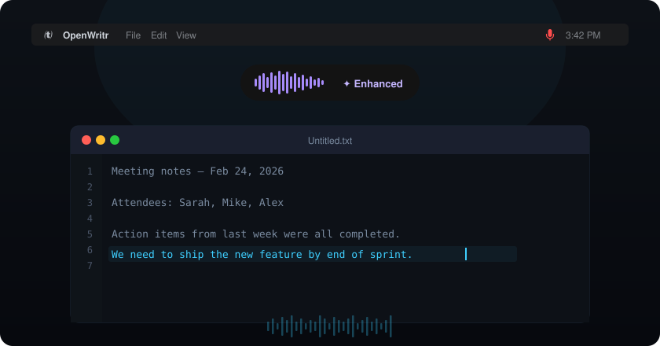

# OpenWritr

[](LICENSE)
[](https://github.com/trsdn/OpenWritr)
[](https://swift.org)
[](https://github.com/trsdn/OpenWritr)
[](https://github.com/trsdn/OpenWritr/releases)
[](https://github.com/trsdn/OpenWritr/releases)

Native macOS menu bar app for push-to-talk voice-to-text. Core transcription runs locally on the Apple Neural Engine; optional enhancement can use Apple Intelligence, GitHub Copilot, or any OpenAI-compatible API.

**[Website](https://trsdn.github.io/OpenWritr/)** · **[Download](https://github.com/trsdn/OpenWritr/releases/latest/download/OpenWritr-v1.5.1-macOS-arm64.zip)** · **[Release](https://github.com/trsdn/OpenWritr/releases)**

<p align="center">
  
</p>

## How It Works

1. **Hold the hotkey** — start a normal transcription, or hold `Shift + hotkey` for enhanced cleanup
2. **Release** — audio is transcribed locally via NVIDIA Parakeet TDT v3 on the Neural Engine
3. **Text appears** — the result is pasted into the focused app, with optional cleanup via Apple Intelligence, Copilot, or an OpenAI-compatible API

The bottom-center recording indicator uses a live, voice-reactive waveform. Listening, transcription, enhancement, completion, and error states share the same compact borderless design.

## Performance

| Metric | Value |
|--------|-------|
| Local transcription latency | < 1 second |
| Model | NVIDIA Parakeet TDT 0.6B v3 |
| Inference | Apple Neural Engine via CoreML |
| Runtime memory | ~38 MB physical |
| Peak memory | ~48 MB physical |
| App bundle | 7.9 MB |
| Download (zip) | 3.2 MB |
| Model size | ~460 MB (downloaded on first launch) |
| Languages | 25 (English, German, French, Spanish, and more) |
| Transcript/audio sent to cloud | Audio never leaves the device; Apple Intelligence cleanup stays on-device, while other Enhanced Mode providers receive transcript text |

## Requirements

- macOS 14+
- Apple Silicon (M1 or later)

Apple Intelligence cleanup additionally requires macOS 26+, a compatible Mac, Apple Intelligence enabled in System Settings, and the on-device model ready. OpenWritr keeps its macOS 14 minimum and explains when this provider is unavailable.

When **System Default** is selected, OpenWritr follows macOS input-device changes and automatically retries after transient Bluetooth or AirPods handoffs.

### Model-tuned cleanup prompts

Each cleanup model has a visible bundled default tuned for that provider and model. Prompts are read-only until **Edit** is selected. Custom prompts are stored separately per provider/model, survive application updates, and are never silently discarded when switching models.

Enhanced Mode can run on demand with **Shift + hotkey**, or **Always Enhance Recordings** can clean up every recording. In always-enhanced mode, holding Shift temporarily bypasses cleanup. The listening overlay immediately shows whether the current recording will be enhanced.

## Install

Download the latest signed app from [Releases](https://github.com/trsdn/OpenWritr/releases), unzip it, and move `OpenWritr.app` to `/Applications`.

To build from source:

```sh
git clone https://github.com/trsdn/OpenWritr.git
cd OpenWritr
swift build -c release
bash scripts/build-app.sh
cp -R .build/release/OpenWritr.app /Applications/
open /Applications/OpenWritr.app
```

`swift build -c release` is enough for a fast compile check. `scripts/build-app.sh` creates the signed `.app` bundle and requires a locally available Developer ID Application or Apple Development certificate.

### Cleanup model evaluation

OpenWritr includes a synthetic, privacy-safe benchmark for comparing Apple Intelligence with Copilot models. It uses the production prompt profiles, sends every model the same cases, records latency and failures, and scores terminology preservation, forbidden additions, punctuation, output format, and reference similarity. Apple Intelligence additionally uses the same Swift integrity validator and bounded repair policy in production and evaluation.
Each report also embeds GitHub's current input, cached-input, cache-write, and output prices per million tokens for the selected models.

```sh
# Fast smoke comparison
python3 scripts/evaluate-cleanup-models.py \
  --models apple-intelligence gpt-5.6-luna \
  --case-limit 2

# Full repeated comparison, including a blind quality judge
python3 scripts/evaluate-cleanup-models.py \
  --runs 3 \
  --workers 3 \
  --judge-model gpt-5.6-sol

# Evaluate a candidate with model-specific prompt suffixes
python3 scripts/evaluate-cleanup-models.py \
  --prompt-config Sources/OpenWritr/Resources/cleanup-prompt-profiles.json
```

The default comparison covers Apple Intelligence, Luna, Gemini Flash, MAI Flash, GPT-5 Mini, and Claude Haiku. Reports are written to `.artifacts/cleanup-eval/` and are not committed. Add only synthetic or explicitly approved transcripts to `eval/cleanup-cases.json`; never add private dictation.

### Signed DMG release

The release flow builds a Developer ID signed app, notarizes and staples the app bundle, packages a
ZIP from that notarized app, then creates and notarizes a DMG. GitHub Releases for `v*` tags receive:

- notarized ZIP + SHA-256 checksum
- notarized DMG + SHA-256 checksum
- an additional `OpenWritr-{version}.dmg` (same signed/notarized bytes, renamed for [AppUpdater](#in-app-updates))

Required GitHub Actions secrets:

- `MACOS_CERTIFICATE` — base64-encoded Developer ID Application `.p12`
- `MACOS_CERTIFICATE_PWD` — password for the `.p12`
- `APPLE_ID` — Apple ID used for notarization
- `APPLE_TEAM_ID` — Apple Developer Team ID
- `APPLE_APP_PASSWORD` — app-specific password for notarization

For local releases, copy the example environment and store a notary profile once:

```sh
cp .release.env.example .release.env
xcrun notarytool store-credentials OpenWritr \
  --apple-id "your@email.com" \
  --team-id "G69Z5BNY97" \
  --password "app-specific-password"

scripts/release_macos.sh
```

Important: if you distribute a ZIP, notarize and staple the `.app` before creating the archive. A
stapled DMG ticket alone does not protect ZIP distribution.

Then grant **Microphone** and **Accessibility** permissions when prompted. The Parakeet model downloads automatically (~460 MB).

### In-app updates

OpenWritr checks `trsdn/OpenWritr` GitHub Releases for newer, Developer ID-signed builds using [AppUpdater](https://github.com/mxcl/AppUpdater), and installs them in place:

- Automatic checks run roughly every 24 hours (toggle: **Settings → Updates**); a manual check is also available from the menu bar.
- Before installing, AppUpdater checks that the downloaded app has the same Developer ID Team ID, signing identifier and bundle identifier as the installed app. Nothing is installed from an unsigned or mismatched build.
- **OpenWritr 1.6.0 cannot update itself.** It was built to require GitHub Artifact Attestation, which does not work with the current release pipeline (see [#31](https://github.com/trsdn/OpenWritr/issues/31)). It reports the update check as failed. Install the next release manually from the Releases page; later versions update themselves.
- The release workflow publishes an extra `OpenWritr-{version}.dmg` asset specifically for this update check, alongside the existing versioned ZIP/DMG downloads above.

## Architecture

```
Sources/OpenWritr/
├── OpenWritrApp.swift          # App entry, MenuBarExtra, state machine
├── MenuBarView.swift           # Menu bar dropdown UI
├── SettingsView.swift          # Dedicated settings window
├── AudioEngine.swift           # AVAudioEngine, 16kHz capture, realtime-safe
├── TranscriptionManager.swift  # FluidAudio model loading + transcription
├── GrammarEnhancer.swift       # Cleanup provider routing and remote providers
├── AppleIntelligenceEnhancer.swift # macOS 26+ on-device cleanup
├── AppleCleanupPolicy.swift    # Shared Apple validation and repair policy
├── CleanupIntegrityValidator.swift # Meaning-preservation checks
├── HotkeyManager.swift         # CGEventTap for Fn/Globe key detection
├── KeychainStore.swift         # Keychain-backed storage for API credentials
├── PasteManager.swift          # Clipboard save/restore + Cmd+V simulation
├── OverlayPanel.swift          # Borderless voice-reactive bottom overlay
├── SoundManager.swift          # Programmatic audio cue generation
├── UpdateManager.swift         # AppUpdater-backed in-app update checks/install
└── PermissionsManager.swift    # Microphone + Accessibility permission handling
```

## Tech Stack

- **Swift 6 / SwiftUI** — strict concurrency, MenuBarExtra
- **FluidAudio** — CoreML-optimized ASR framework
- **NVIDIA Parakeet TDT 0.6B v3** — non-autoregressive transducer, 25 languages
- **Apple Neural Engine** — hardware-accelerated inference via CoreML
- **AVAudioEngine** — low-latency microphone capture at 16kHz
- **CGEventTap** — global Fn key detection (requires Accessibility permission)
- **AppUpdater** — signed, in-app update checks against GitHub Releases

## License

[MIT](LICENSE)
