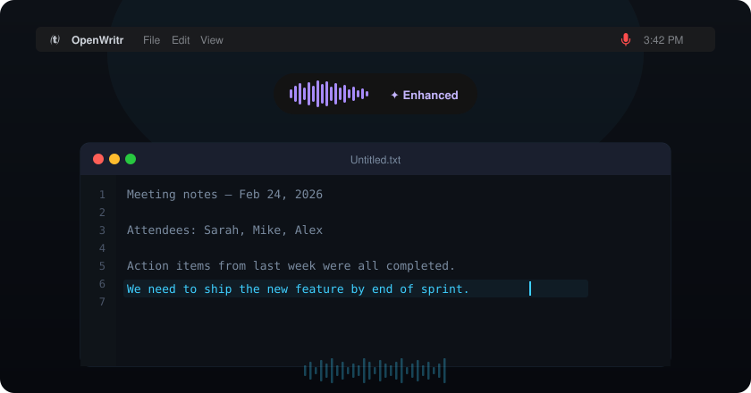

# OpenWritr

[](LICENSE)
[](Package.swift)
[](https://github.com/trsdn/OpenWritr/actions/workflows/ci.yml)
[](https://github.com/trsdn/OpenWritr/releases/latest)
[](.github/conformance.yml)

**Status: actively maintained.** Native macOS push-to-talk voice-to-text app. Core transcription runs locally on the Apple Neural Engine; optional enhancement can use Apple Intelligence, GitHub Copilot, or any OpenAI-compatible API.

**[Website](https://trsdn.github.io/OpenWritr/)** · **[Download](https://github.com/trsdn/OpenWritr/releases/latest)** · **[Changelog](CHANGELOG.md)**

<p align="center">
  
</p>

## How It Works

1. **Hold the hotkey** — start a normal transcription, or hold `Shift + hotkey` for enhanced cleanup
2. **Release** — audio is transcribed locally via NVIDIA Parakeet TDT v3 on the Neural Engine
3. **Text appears** — the result is pasted into the focused app, with optional cleanup via Apple Intelligence, Copilot, or an OpenAI-compatible API. Hold `Option + hotkey` to replace the clipboard instead, without pasting.

The bottom-center recording indicator uses a live, voice-reactive waveform. Listening, transcription, enhancement, completion, and error states share the same compact borderless design.

OpenWritr starts as a menu bar utility. In **Settings → App → Show OpenWritr In**, you can instead show it only in the Dock or in both the Dock and menu bar. Dock modes also make OpenWritr available in Command-Tab; use the OpenWritr app menu or `Command-,` to reopen Settings.

## Performance

| Metric | Value |
|--------|-------|
| Local transcription latency | < 1 second |
| Model | NVIDIA Parakeet TDT 0.6B v3 |
| Inference | Apple Neural Engine via CoreML |
| Runtime memory | ~38 MB physical |
| Peak memory | ~48 MB physical |
| App bundle | 7.9 MB |
| Download (zip) | 3.2 MB |
| Model size | ~460 MB (downloaded on first launch) |
| Languages | 25 (English, German, French, Spanish, and more) |
| Transcript/audio sent to cloud | Audio never leaves the device; Apple Intelligence cleanup stays on-device, while other Enhanced Mode providers receive transcript text |

## Requirements

- macOS 14+
- Apple Silicon (M1 or later)

Apple Intelligence cleanup additionally requires macOS 26+, a compatible Mac, Apple Intelligence enabled in System Settings, and the on-device model ready. OpenWritr keeps its macOS 14 minimum and explains when this provider is unavailable.

When **System Default** is selected, OpenWritr follows macOS input-device changes and automatically retries after transient Bluetooth or AirPods handoffs.

### Model-tuned cleanup prompts

Each cleanup model has a visible bundled default tuned for that provider and model. Prompts are read-only until **Edit** is selected. Custom prompts are stored separately per provider/model, survive application updates, and are never silently discarded when switching models.

Enhanced Mode can run on demand with **Shift + hotkey**, or **Always Enhance Recordings** can clean up every recording. In always-enhanced mode, holding Shift temporarily bypasses cleanup. The listening overlay immediately shows whether the current recording will be enhanced.

Copilot cleanup explicitly uses **low reasoning effort for GPT-6 Luna**, independently of the CLI's saved reasoning preference. Other models keep their existing CLI defaults. Copilot requests have a bounded **90-second timeout** to accommodate CLI startup and slow provider responses; this does not guarantee that every request will finish. If cleanup fails or times out, OpenWritr retains the raw transcript for retry or raw-output recovery rather than silently claiming success.

The Copilot picker uses GPT-6 Luna (default), Gemini 3.8 Flash, MAI Code 1.1 Flash, GPT-5.4 Mini, and Claude Haiku 5.5. Saved predecessor selections migrate within their model family. Custom Copilot prompts are copied to successor targets only when no successor customization exists; original prompts and OpenAI-compatible endpoint targets remain untouched. Availability depends on your account and Copilot CLI.

Standard-context GitHub rates in USD per million tokens, checked on 2026-10-09:

| Model | Input | Cached input | Cache write | Output |
|---|---:|---:|---:|---:|
| GPT-6 Luna | $0.10 | $0.01 | $0.125 | $0.50 |
| Gemini 3.8 Flash | $0.75 | $0.075 | N/A | $3.75 |
| MAI Code 1.1 Flash | $0.20 | $0.02 | N/A | $1.20 |
| GPT-5.4 Mini | $0.75 | $0.075 | N/A | $4.50 |
| Claude Haiku 5.5 | $0.10 | $0.01 | $0.125 | $0.50 |

These are reference rates, not a per-recording quote; context tiers and actual usage affect cost. Check [GitHub's current pricing](https://docs.github.com/en/copilot/reference/copilot-billing/models-and-pricing) for changes.

### Clipboard-only recordings

Hold **Option + Fn** or **Option + Right Command** to copy the final transcript without inserting it into the focused application. When **Right Option** is the configured push-to-talk key, use **Left Option + Right Option** instead; Right Option alone keeps its normal behavior.

Option and Shift are independent: add Shift to use the existing enhancement/bypass behavior. Pressing Option at any point while holding the recording key latches clipboard-only output, even if Option is released first. The overlay shows **Clipboard** while listening (purple when enhanced), then **Copied** after a successful write.

Clipboard-only works even with Auto-Paste off. Successful copying intentionally replaces the clipboard and keeps the result available for manual paste. Cancellation, silence, or processing failure leaves the clipboard unchanged; enhancement retry and raw-transcript recovery retain the chosen destination.

Normal Auto-Paste restores the original clipboard, including an empty clipboard, unless another application or the user has changed it. Output errors are shown explicitly; delayed restoration errors appear as a dismissible menu warning. With Auto-Paste off, standard recordings remain inside OpenWritr and are not copied automatically.

## Install

Download the latest signed app from [Releases](https://github.com/trsdn/OpenWritr/releases), unzip it, and move `OpenWritr.app` to `/Applications`.

To build from source, follow **Setup** and **Run** in [AGENTS.md](AGENTS.md#setup). Building the signed app needs a Developer ID Application or Apple Development certificate in your keychain.

Then grant **Microphone** and **Accessibility** permissions when prompted. The Parakeet model downloads automatically (~460 MB).

### Cleanup model evaluation

OpenWritr includes a synthetic, privacy-safe benchmark for comparing Apple Intelligence with Copilot models. It uses the production prompt profiles, sends every model the same cases, records latency and failures, and scores terminology preservation, forbidden additions, punctuation, output format, and reference similarity. Apple Intelligence additionally uses the same Swift integrity validator and bounded repair policy in production and evaluation.
Each report also embeds GitHub's current input, cached-input, cache-write, and output prices per million tokens for the selected models.

```sh
# Fast smoke comparison
python3 scripts/evaluate-cleanup-models.py \
  --models apple-intelligence gpt-6-luna \
  --case-limit 2

# Full repeated comparison, including a blind quality judge
python3 scripts/evaluate-cleanup-models.py \
  --runs 3 \
  --workers 3 \
  --judge-model gpt-6.1-sol

# Evaluate a candidate with model-specific prompt suffixes
python3 scripts/evaluate-cleanup-models.py \
  --prompt-config Sources/OpenWritr/Resources/cleanup-prompt-profiles.json
```

The default comparison covers Apple Intelligence, GPT-6 Luna, Gemini 3.8 Flash, MAI Code 1.1 Flash, GPT-5.4 Mini, and Claude Haiku 5.5. Reports are written to `.artifacts/cleanup-eval/` and are not committed. Add only synthetic or explicitly approved transcripts to `eval/cleanup-cases.json`; never add private dictation.

The dataset includes eight adversarial dictated-text cases: instruction overrides, fake message roles, translation requests, prompt disclosure, tool requests, fake transcript delimiters, misuse of the empty-output sentinel, and questions that try to elicit answers. Expected behavior is to edit and preserve the dictated text, not obey or refuse it. These cases require the reference word sequence (allowing casing/punctuation changes); any omission or addition sets the rule score to zero. Reports include per-case `preservation_passed` and per-model `adversarial_preservation` counts, with errors counted as non-passes. This is deliberately strict regression coverage, not proof of universal prompt-injection resistance.

Copilot cleanup runs with an empty available-tool list. Both production and benchmark requests identify a JSON-encoded transcript value as untrusted data, keeping embedded quotes, newlines, and fake delimiters inside that value. Bundled cleanup instructions require minimal corrections, preserve facts, negation, and literal tags/tokens, exclude runtime reminders from output, and consistently use `[[EMPTY]]` for filler-only input. Saved custom prompts are not overwritten; select **Reset** for the model's bundled prompt to adopt updated cleanup instructions.

#### Waza grading and regression comparisons

[Microsoft Waza](https://microsoft.github.io/waza/) is an optional local evaluation
tool (integration verified with version 0.38.7). Model requests still run through
the production-aligned runner above, not Waza's Copilot SDK executor. Waza grades
captured outputs offline, so regrading/comparing does not send another model
request or require an LLM judge.

```sh
# Grade an existing captured report; no model requests are made
python3 scripts/waza-cleanup.py grade .artifacts/cleanup-eval/latest.json \
  --output-dir .artifacts/waza/candidate

# Grade a saved baseline using the same dataset and thresholds
python3 scripts/waza-cleanup.py grade /path/to/baseline.json \
  --output-dir .artifacts/waza/baseline

waza --no-update-check compare \
  .artifacts/waza/baseline/graded.json .artifacts/waza/candidate/graded.json

# Fail on any pass-rate regression, missing/new tasks, or failed injection case
waza --no-update-check gate \
  --baseline .artifacts/waza/baseline/graded.json \
  --current .artifacts/waza/candidate/graded.json \
  --on-new-tasks fail --on-removed-tasks fail
```

The adapter generates Waza specs, case snapshots, captured outcomes, and graded
results under the chosen output directory. **Do not execute these specs with
`waza run`**: they are for grading captured transcripts, not SDK agent execution.
Reports retain source prompt configuration, real outputs, repetitions, errors,
and latency; they do not invent tool traces or token usage. Historical reports
without a recorded timeout retain an unknown timeout (`0`).

The program grader reuses the existing deterministic cleanup scorer. Ordinary
cases pass at a score of at least **0.90** (`--minimum-score` changes this explicit
threshold); adversarial cases additionally require strict text preservation and
are marked **golden/must-pass** for `waza gate`. Errors always remain nonpasses.
Waza's program-grader score is binary pass/fail, **not** the original continuous
cleanup score; use the source report for detailed quality/latency analysis.
Successful grading exits zero even when cases fail; use `waza gate` to enforce
the results. Each model/case is one task; every captured repetition must pass for
that task to pass. Use the same threshold and case set on both sides of a comparison.

Use `--category prompt-injection` to compare just the adversarial cases.
Incomplete reports, duplicate runs, and input/reference/category mismatches
against the dataset are rejected rather than silently skipped. If cases changed,
supply their original dataset with `--dataset`. These commands are opt-in; CI
does not automatically run billed model evaluations.

### Signed DMG release

Distributable builds come from the public
[`trsdn/macos-notarization-broker`](https://github.com/trsdn/macos-notarization-broker)
profile `openwritr`. The broker resolves an immutable tag, builds without
secrets, validates on a fresh runner, then signs, notarizes, staples, and
packages with broker-owned code and credentials. OpenWritr has no Apple
certificate or notary secret, and its workflows never sign or notarize.

GitHub Releases receive exactly:

- `OpenWritr-v{version}-macOS-arm64.zip`
- `OpenWritr-v{version}-macOS-arm64.zip.sha256`
- `OpenWritr-v{version}-macOS-arm64.dmg`
- `OpenWritr-v{version}-macOS-arm64.dmg.sha256`
- `OpenWritr-{version}.dmg` (the same signed/notarized DMG bytes under the exact
  name required by [AppUpdater](#in-app-updates))

The maintainer requests the broker build from the broker checkout:

```sh
scripts/request.sh openwritr vX.Y.Z /path/to/OpenWritr/.artifacts/broker-release
```

Then OpenWritr's secretless publication handoff creates a draft, runs the
checkout-free transcription smoke test against that draft, and publishes only
after the tag, checksums, exact five-asset contract, and smoke result pass.
See [RELEASE_CHECKLIST.md](RELEASE_CHECKLIST.md) for the maintainer-only
procedure and authorization boundary.

The broker attests the OpenWritr ZIP only. It deliberately does **not** attest
either DMG, because the AppUpdater alias and versioned DMG have the same digest
and an attestation for that digest can crash OpenWritr 1.6.0's updater path
(see [#31](https://github.com/trsdn/OpenWritr/issues/31)).

### In-app updates

OpenWritr checks `trsdn/OpenWritr` GitHub Releases for newer, Developer ID-signed builds using [AppUpdater](https://github.com/mxcl/AppUpdater), and installs them in place:

- Automatic checks run roughly every 24 hours (toggle: **Settings → Updates**); a manual check is also available from the menu bar.
- Before installing, AppUpdater checks that the downloaded app has the same Developer ID Team ID, signing identifier and bundle identifier as the installed app. Nothing is installed from an unsigned or mismatched build.
- **OpenWritr 1.6.0 cannot update itself.** It was built to require GitHub Artifact Attestation, which does not work with the current release pipeline (see [#31](https://github.com/trsdn/OpenWritr/issues/31)). It reports the update check as failed. Install the next release manually from the Releases page; later versions update themselves.
- The broker publication handoff publishes an extra `OpenWritr-{version}.dmg` asset specifically for this update check, alongside the existing versioned ZIP/DMG downloads above.

## Privacy

- **Audio never leaves your Mac.** Recordings are transcribed on-device and are not written to disk.
- **Transcript text leaves your Mac only if you turn on Enhanced Mode with a remote provider.** Apple Intelligence cleanup stays on-device. GitHub Copilot and an OpenAI-compatible API receive the transcript text you are cleaning up, and nothing else.
- **No telemetry, analytics, or crash reporting.** OpenWritr has no backend and no account.
- **Outbound connections**, and why:

  | Destination | Purpose | When |
  |---|---|---|
  | Hugging Face (`FluidInference/parakeet-tdt-0.6b-v3-coreml`) | Download the speech model, about 460 MB | First launch |
  | GitHub Releases (`trsdn/OpenWritr`) | Check for and download updates | About every 24 hours; switch off in **Settings → Updates** |
  | GitHub Copilot, through the `copilot` CLI | Cleanup, if you chose a Copilot model | Only with Enhanced Mode |
  | The base URL you enter for an OpenAI-compatible API | Cleanup and model listing | Only with Enhanced Mode on that provider |

- **Stored on your Mac:** preferences and custom cleanup prompts in the `com.openwritr.app` `UserDefaults` domain; API keys in your macOS Keychain; the speech model in `~/Library/Application Support/FluidAudio/Models`. While pasting, the clipboard is saved and restored around the keystroke.
- **Deleting it:** remove the app, then `defaults delete com.openwritr.app`, delete the Keychain items for OpenWritr in Keychain Access, and delete the `FluidAudio` folder above. Nothing else persists across launches, and no transcript history is kept.

## Accessibility

OpenWritr is driven by a held hotkey (Fn/Globe or Right Shift) and can appear in the menu bar, Dock, or both. Settings and the menu use standard SwiftUI controls, which expose names and roles to VoiceOver; the recording overlay carries an accessibility label describing its state. Text uses system fonts and colours.

Known limitations, stated rather than left to be discovered:

- Dictating requires **holding** a key. There is no toggle mode, which can be difficult without fine motor control.
- The overlay shows state visually and does not steal focus; users of assistive technology hear no announcement besides the sound cues.
- The recording overlay and the prompt editor use fixed text sizes; macOS has no Dynamic Type for them to follow.
- The app has **not** been tested with VoiceOver, and the keyboard pass was a source review and an automated guard, not a session at the screen. A report that Settings opens behind another app when opened from the keyboard would mean the activation fix did not work. See [docs/accessibility.md](docs/accessibility.md) for what was checked. Reports are welcome.

Maintainers can generate deterministic light, dark, and larger-text UI evidence
without granting permissions or starting the app:

```sh
swift build -c release
.build/release/OpenWritr --render-ui-snapshots .artifacts/ui-snapshots
```

Relevant pull requests run the same renderer and a read-only GitHub Agentic
Workflow HIG review. See [Automated UI snapshots and HIG review](docs/ui-snapshot-review.md)
for the captured surfaces, preview limitations, and one-time token setup.

## Language

The interface, documentation, and contributor surfaces are **English only**; there are no translations or string catalogs. Speech recognition itself supports 25 languages (see above), and cleanup preserves the language you dictated.

## Versioning and compatibility

Releases follow [Semantic Versioning](https://semver.org): patch releases fix bugs, minor releases add features, and a major release would break saved preferences or the update path. OpenWritr requires macOS 14 or later on Apple Silicon; Intel Macs are not supported. Every change is described in the [changelog](CHANGELOG.md), which is also the source of each GitHub release's notes.

## Verifying a download

Releases are built by the
[notarization broker](https://github.com/trsdn/macos-notarization-broker),
signed with a Developer ID certificate (Team ID `G69Z5BNY97`), and notarized
by Apple. You can check that yourself:

```sh
shasum -a 256 -c OpenWritr-vX.Y.Z-macOS-arm64.zip.sha256
codesign --verify --deep --strict --verbose=2 /Applications/OpenWritr.app
spctl --assess --type execute --verbose /Applications/OpenWritr.app   # expect: source=Notarized Developer ID
xcrun stapler validate /Applications/OpenWritr.app
```

This proves the app was signed by that Team ID and not altered afterwards.
The broker download also carries provenance naming the immutable OpenWritr
source commit. The ZIP may have GitHub build provenance from the broker, but
the DMGs deliberately do not (see [#31](https://github.com/trsdn/OpenWritr/issues/31)).
Third-party licences are bundled in
`OpenWritr.app/Contents/Resources/Licenses/` and listed in
[THIRD_PARTY_NOTICES.md](THIRD_PARTY_NOTICES.md).

## Support and security

- **Bugs and feature requests:** [open an issue](https://github.com/trsdn/OpenWritr/issues/new/choose). Support is best-effort by a single maintainer.
- **Security vulnerabilities:** do not open a public issue; follow the [security policy](https://github.com/trsdn/.github/blob/main/SECURITY.md) and report privately.
- **Contributing:** every change lands through a pull request; `main` is protected and merges are squashed. See [AGENTS.md](AGENTS.md) for the validation command, layout, and rules.

## Repository stats

<picture>
  <source media="(prefers-color-scheme: dark)" srcset="https://raw.githubusercontent.com/trsdn/OpenWritr/stats/.github/stats/repo-card-dark.svg">
  
</picture>

Generated daily by [`stats.yml`](.github/workflows/stats.yml) and committed to the `stats` branch, because `main` is protected.

## Architecture

```
Sources/OpenWritr/
├── OpenWritrApp.swift          # App entry, presence modes, state machine
├── MenuBarView.swift           # Menu bar dropdown UI
├── SettingsView.swift          # Dedicated settings window
├── AudioEngine.swift           # AVAudioEngine, 16kHz capture, realtime-safe
├── TranscriptionManager.swift  # FluidAudio model loading + transcription
├── GrammarEnhancer.swift       # Cleanup provider routing and remote providers
├── AppleIntelligenceEnhancer.swift # macOS 26+ on-device cleanup
├── AppleCleanupPolicy.swift    # Shared Apple validation and repair policy
├── CleanupIntegrityValidator.swift # Meaning-preservation checks
├── HotkeyManager.swift         # CGEventTap for Fn/Globe key detection
├── KeychainStore.swift         # Keychain-backed storage for API credentials
├── PasteManager.swift          # Clipboard save/restore + Cmd+V simulation
├── OverlayPanel.swift          # Borderless voice-reactive bottom overlay
├── SoundManager.swift          # Programmatic audio cue generation
├── UpdateManager.swift         # AppUpdater-backed in-app update checks/install
└── PermissionsManager.swift    # Microphone + Accessibility permission handling
```

## Tech Stack

- **Swift 6 / SwiftUI** — strict concurrency, MenuBarExtra
- **FluidAudio** — CoreML-optimized ASR framework
- **NVIDIA Parakeet TDT 0.6B v3** — non-autoregressive transducer, 25 languages
- **Apple Neural Engine** — hardware-accelerated inference via CoreML
- **AVAudioEngine** — low-latency microphone capture at 16kHz
- **CGEventTap** — global Fn key detection (requires Accessibility permission)
- **AppUpdater** — signed, in-app update checks against GitHub Releases

## License

[MIT](LICENSE)
